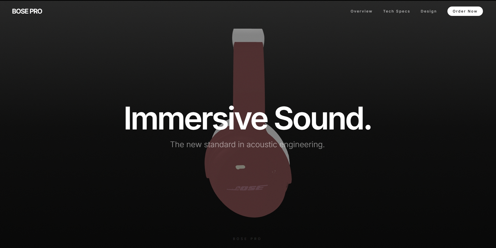

# Clone the repository

`git clone https://github.com/UMDhodi/bose-pro-3D-website.git`
`cd bose-pro-3D-website`

# Install Dependencies

`npm install`

`npm run dev`

`npm run build`

## 📂 Project Structure

├── public/              # Static assets (3D models, images)
├── src/
│   ├── components/      # React components
│   │   ├── Scene.tsx        # Main 3D Canvas setup
│   │   ├── ProductModel.tsx # 3D Model logic & animations
│   │   ├── ScrollOverlay.tsx # HTML text content
│   │   └── OrderOverlay.tsx  # Checkout modal
│   ├── App.tsx          # Main entry point
│   └── index.css        # Global styles & Tailwind
└── vite.config.ts       # Configuration

Author: UMDhodi (Niora Star)
